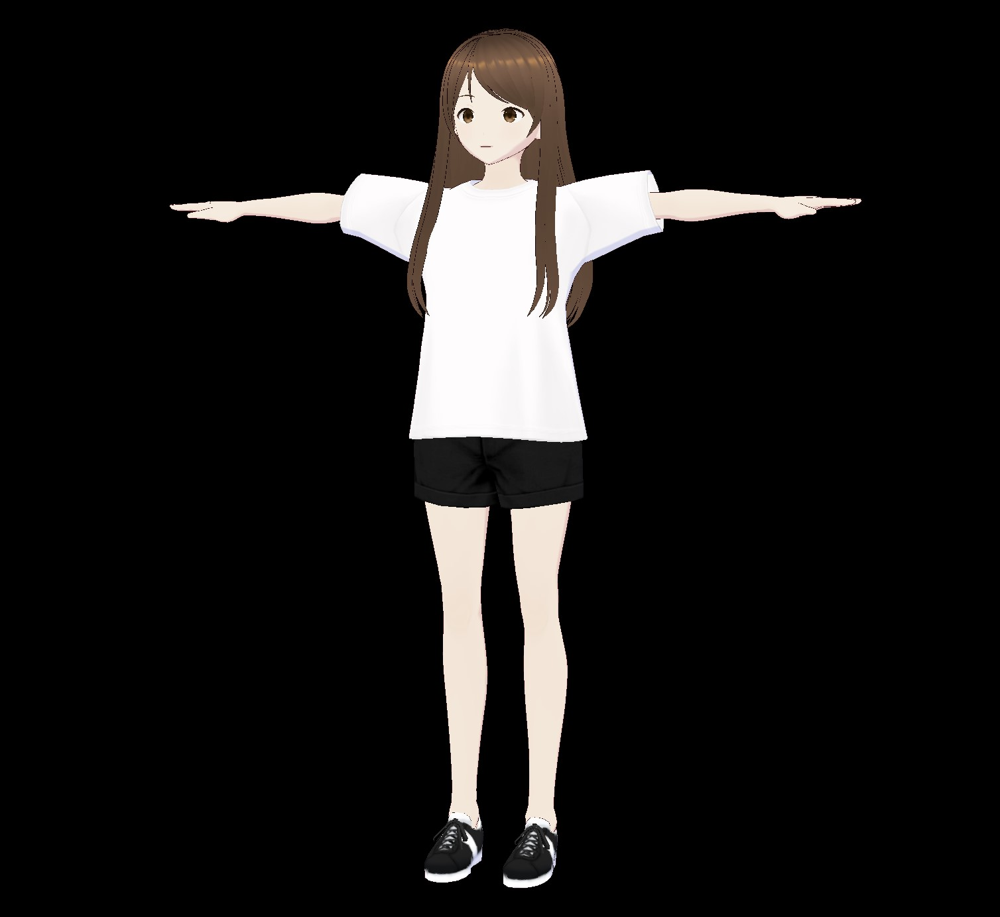
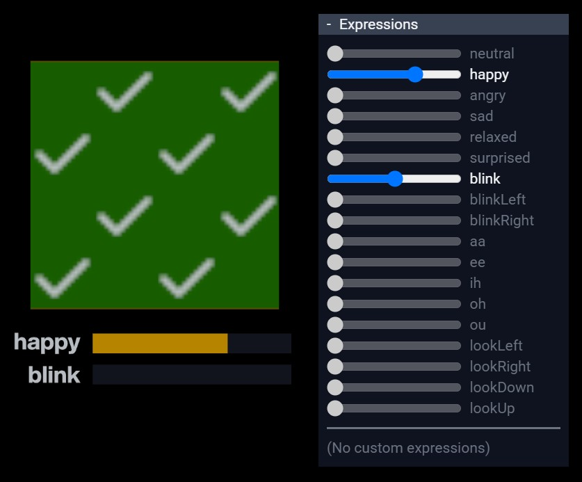

# VRM Samples

!!! warning "🤖 AI 자동 번역 문서"

    이 문서는 AI로 자동 번역된 문서입니다. 아직 검수가 완료되지 않았으므로 **오역이나 부정확한 표현이 포함될 수 있습니다**.

    정확한 내용은 [원본 vrm-specification 문서](https://github.com/vrm-c/vrm-specification)와 비교하여 확인해 주세요.

## Practical

아바타로 사용하기 위한 실용적인 모델입니다.

| Model                                                        | Screenshot                                                  | Description                                                                                                               |
| ------------------------------------------------------------ | ----------------------------------------------------------- | ------------------------------------------------------------------------------------------------------------------------- |
| [Seed-san](Seed-san)                                         |                      | PBR 매터리얼, MToon 매터리얼, SpringBones, Constraints (Rotation), Expressions (Morph, UV Transform), LookAt (Expression) |
| [VRM1_Constraint_Twist_Sample](VRM1_Constraint_Twist_Sample) |  | Expressions (Morph), LookAt (Bones), MToon 매터리얼, SpringBones, Constraints (Roll and Aim)                              |

## Feature Tests

VRM 확장 제품군의 특정 기능을 테스트하기 위한 모델입니다.

| Model                                                                                | Screenshot                                                              | Description                                                                                        |
| ------------------------------------------------------------------------------------ | ----------------------------------------------------------------------- | -------------------------------------------------------------------------------------------------- |
| [VRMC_vrm_expressions_isBinary_Overrides](VRMC_vrm_expressions_isBinary_Overrides)   |   | isBinary가 있는 Expression이 다른 Expression을 성공적으로 오버라이드(override)하는지 테스트합니다. |
| [VRMC_vrm_expressions_isBinary_Overridden](VRMC_vrm_expressions_isBinary_Overridden) |  | isBinary가 있는 Expression이 다른 Expression에 의해 성공적으로 오버라이드되는지 테스트합니다.      |
| [VRMC_materials_mtoon_UV_Animation_Test](VRMC_materials_mtoon_UV_Animation_Test)     |    | MToon의 UV 애니메이션 기능이 올바르게 지원되는지 테스트합니다.                                     |
