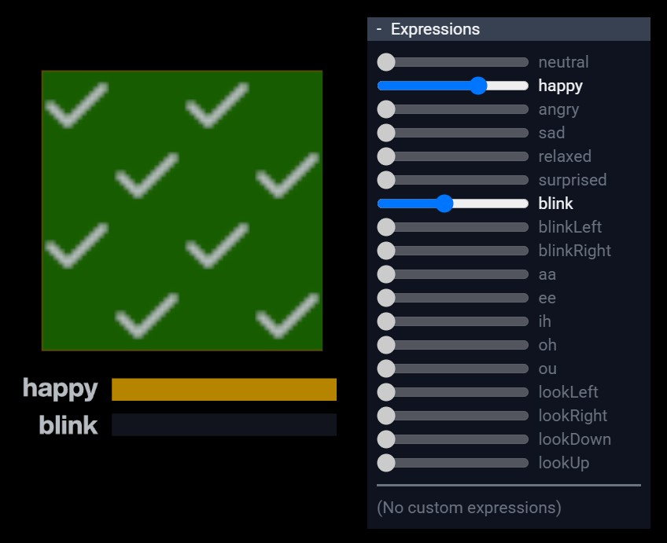

# VRMC_vrm expressions isBinary Overrides Test

## Screenshot



## Description

이 모델은 [VRMC_vrm](../../specification/VRMC_vrm-1.0/) 확장의 예시입니다.

isBinary가 있는 Expression이 다른 Expression을 오버라이드할 때, [사양에 명시된 바와 같이](https://github.com/vrm-c/vrm-specification/blob/master/specification/VRMC_vrm-1.0/expressions.md#interaction-between-override-and-isbinary) 이진(binary) 출력 값을 사용하여 다른 Expression에 영향을 주어야 합니다.
이 모델은 `happy`의 값이 0.5보다 클 때 오버라이드하는 isBinary `happy` Expression이 오버라이드되는 `blink` Expression을 성공적으로 억제하는지 테스트합니다.

여러 개의 체크 표시가 있는 큰 녹색 평면은 Expression 값이 예상 범위 내에 있음을 나타냅니다.
X 표시가 나타나거나 빨간색 영역이 보이면 Expression의 구현이 올바르지 않음을 나타냅니다.

큰 평면 아래에는 Expression의 출력 값을 나타내는 노란색 막대도 있습니다.

이 모델의 Expression은 다음과 같이 정의됩니다:

```json
"expressions": {
    "preset": {
        "happy": {
            "overrideBlink": "blend",
            "isBinary": true,
            "textureTransformBinds": [ ... ]
        },
        "blink": {
            "textureTransformBinds": [ ... ]
        }
    }
}
```

## License Information

[VRM Public License 1.0](https://vrm.dev/licenses/1.0/)

(c) 2025 pixiv Inc.
