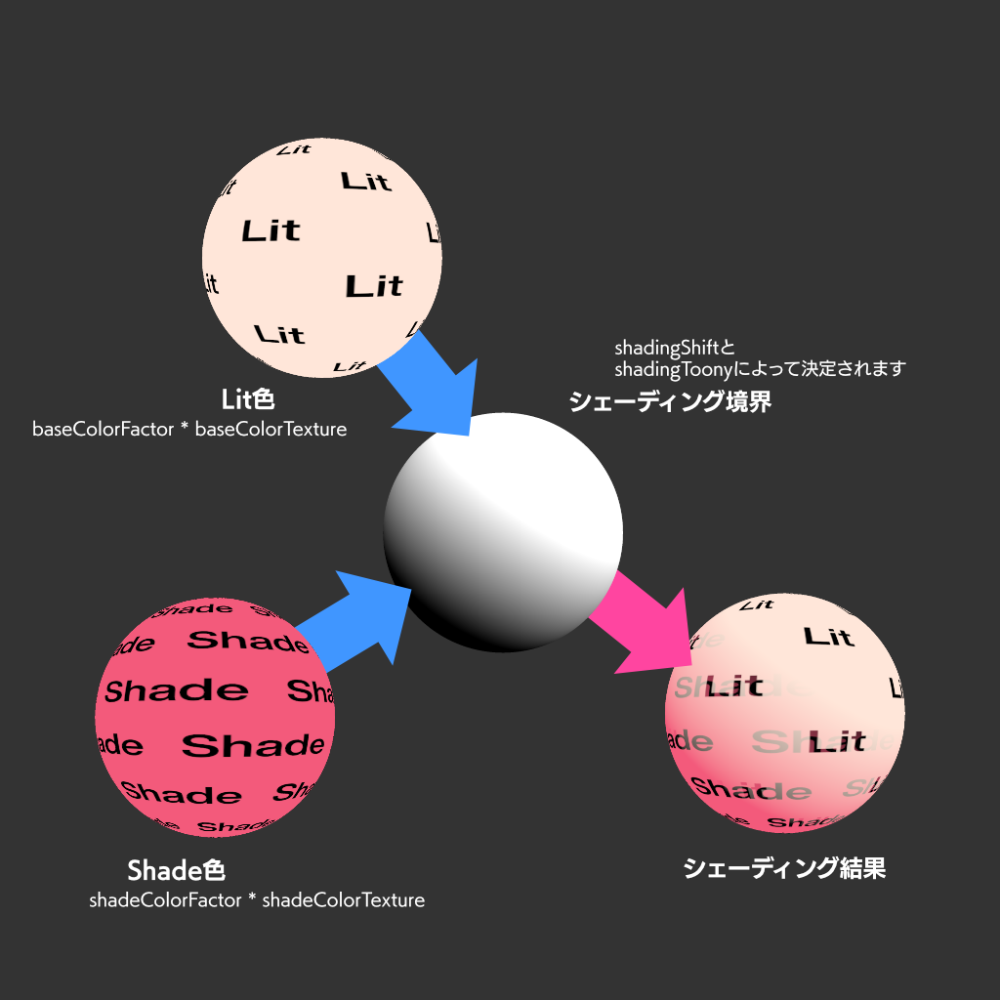
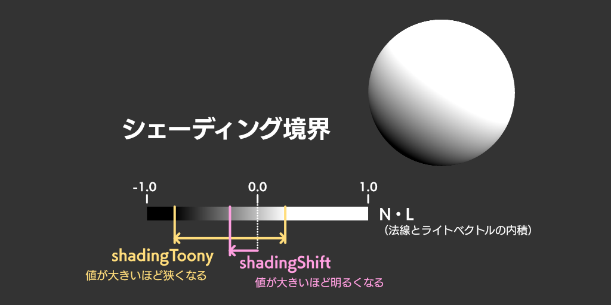

# VRMC_materials_mtoon

!!! warning "🤖 AI 자동 번역 문서"

    이 문서는 AI로 자동 번역된 문서입니다. 아직 검수가 완료되지 않았으므로 **오역이나 부정확한 표현이 포함될 수 있습니다**.

    정확한 내용은 [원본 vrm-specification 문서](https://github.com/vrm-c/vrm-specification)와 비교하여 확인해 주세요.

_Version 1.0_

## Contributors

- 카쿠 마우
- 오부치 유타카

## Status

Complete

## Dependencies

glTF 2.0 사양을 바탕으로 작성되었습니다.

### `KHR_materials_unlit`과의 상호작용

`VRMC_materials_mtoon`과 함께 매테리얼에 `KHR_materials_unlit`이 설정되어 있는 경우, `VRMC_materials_mtoon`을 우선하여 해석하십시오.

MToon 셰이더의 구현이 어려운 경우, `KHR_materials_unlit`으로 폴백하십시오.

## Overview

이 확장은 VRM을 위한 툰 셰이더 구현입니다.

툰 셰이더적인 효과를 부여하면서 PBR의 씬 라이팅과 협조하는 것을 목적으로 합니다.
일본의 손그림 애니메이션 표현에만 특화하지는 않습니다.

이때 원래 툰 셰이더는 이미지 처리적인 접근을 필요로 하지만, 본 확장에서는 이를 피하고 근사 정의를 수행합니다.
따라서 본 정의에서는 특정 렌더링 방식에 의존하는 정의를 포함합니다.

## Extending Materials

매테리얼의 `extensions`에 정의합니다.

```json
{
  "materials": [
    {
      "name": "MyUnlitMaterial",
      "pbrMetallicRoughness": {
        "baseColorFactor": [0.5, 0.8, 0.0, 1.0]
        // texture
      },
      // emission

      "extensions": {
        "VRMC_materials_mtoon": {
          "specVersion": "1.0"
          // ...
        }
      }
    }
  ]
}
```

## Definition

### Types

타입 정의 중 Color와 Texture는 glTF에 준하여 리니어 색 공간(Linear Colorspace)에 저장됩니다.

### Vertex Colors

MToon 매테리얼에 대해서는 버텍스 컬러를 무시합니다.

### Coordinates

UV 좌표계에 대해서

### BRDF

### Meta

MToon 자체의 메타 정보에 관한 정의를 설명합니다.

#### MToon Defined Properties

|             | 타입     | 설명                | 필수   |
| ----------- | -------- | ------------------- | :----- |
| specVersion | `string` | 이 확장의 버전 번호 | ✅ Yes |

#### specVersion

VRMC_materials_mtoon 확장의 버전 번호를 나타냅니다.
값은 `"1.0"`입니다.

- 타입: `string`
- 필수: Yes

### Rendering

렌더링에 관한 MToon의 정의를 설명합니다.

#### Render Mode

이 매테리얼이 어떤 알파 처리로 렌더링되는지 지정합니다.
알파 값은 glTF 사양에서 정의된 `pbrMetallicRoughness.baseColorFactor` 및 `pbrMetallicRoughness.baseColorTexture`에 정의된 알파 값을 참조합니다.
알파 값 처리는 glTF 사양에 정의된 `alphaMode` 및 `alphaCutoff`를 사용합니다.
각 처리의 자세한 사항에 대해서는 glTF의 사양을 준수합니다.

glTF에서 정의된 `alphaMode`에 더하여, 본 확장에서는 `transparentWithZWrite`라는 프로퍼티를 제공합니다.
일반적으로 `alphaMode`가 `BLEND`인 경우 ZBuffer에 대한 쓰기를 권장하지 않지만,
이 프로퍼티가 `true`인 경우 `alphaMode`가 `BLEND`일 때 ZBuffer에 쓰기를 권장합니다.

> `transparentWithZWrite`의 구현이 어려운 경우, 일반적인 알파 블렌딩 처리로 폴백해 주십시오.

#### Render Queue

이 매테리얼이 어떤 순서로 렌더링되어야 하는지를 지정합니다.
MToon은 다음과 같은 순서로 렌더링될 것을 기대합니다.

1. `alphaMode`가 `OPAQUE`
2. `alphaMode`가 `MASK`
3. `alphaMode`가 `BLEND`이고 `transparentWithZWrite`가 `true`
4. `alphaMode`가 `BLEND`이고 `transparentWithZWrite`가 `false`

툰 셰이더에서는 반투명 표현이 다용되므로 렌더링 순서로 인한 문제가 발생하기 쉽습니다.
MToon에서는 이를 위해 `transparentWithZWrite`를 도입하였고, 나아가 렌더링 순서 제어 방식을 도입하였습니다.
`renderQueueOffsetNumber`는 각각의 Render Mode의 기본 렌더링 순서에 대한 오프셋 값입니다.
Unity에 있어서 매테리얼별 Render Queue 값에 오프셋으로 가산되는 동작을 기대합니다.
`renderQueueOffsetNumber`는 `alphaMode`가 `BLEND`일 때 작용합니다.
값이 클수록 렌더링 순서는 뒤로 미뤄집니다.
값이 가질 수 있는 범위에 대해 다음 표에 나타냅니다.

|                                                             | Min Value | Max Value |
| :---------------------------------------------------------- | :-------- | :-------- |
| `alphaMode`가 `OPAQUE`                                      | `0`       | `0`       |
| `alphaMode`가 `MASK`                                        | `0`       | `0`       |
| `alphaMode`가 `BLEND`이고 `transparentWithZWrite`가 `true`  | `0`       | `+9`      |
| `alphaMode`가 `BLEND`이고 `transparentWithZWrite`가 `false` | `-9`      | `0`       |

`renderQueueOffsetNumber`가 어떤 값이 되든 상관없이, 앞서 언급한 Render Queue에 의한 렌더링 순서가 우선됩니다.

MToon이 아닌 다른 glTF 모델 등과 함께 렌더링을 수행할 경우, 그들의 `renderQueueOffsetNumber`는 `0`으로 가정하여 렌더링 순서를 제어해 주십시오.

Unity에서의 Render Queue에 상당하는 렌더링 순서 제어가 구현상 어렵다면, `renderQueueOffsetNumber`가 `0`이라고 간주해 주십시오.

#### MToon Defined Properties

|                           | 타입      | 설명                                                     | 필수                |
| :------------------------ | :-------- | :------------------------------------------------------- | :------------------ |
| `transparentWithZWrite`   | `boolean` | `alphaMode`가 `BLEND`일 때, ZBuffer 쓰기를 수행할지 여부 | No, 초기값: `false` |
| `renderQueueOffsetNumber` | `integer` | 렌더링 순서에 대한 오프셋 값                             | No, 초기값: `0`     |

#### transparentWithZWrite

`alphaMode`가 `BLEND`일 때, ZBuffer 쓰기를 수행할지를 지정합니다.

- 타입: `boolean`
- 필수: No, 초기값: `false`

#### renderQueueOffsetNumber

앞서 설명한 Render Queue의 오프셋 값을 지정합니다.

- 타입: `integer`
- 필수: No, 초기값: `0`

#### Double Sided

양면 폴리곤은 glTF 코어 사양의 매테리얼 정의에 포함된 `doubleSided`를 사용하는 Double Sided의 정의에 준합니다.

단, 본 확장이 정의하는 윤곽선([Outline](#Outline) 참조) 렌더링은 `doubleSided` 상태와 관계없이 항상 front-face culling이 활성화됩니다.

### Lighting

라이팅에 관한 정의를 설명합니다.

#### Lighting Model

MToon은 Lambert 반사 모델을 확장합니다.
일반적인 Lambert 반사 모델과 마찬가지로, 표면의 노멀(법선)과 라이트 벡터에 의해 음영이 처리되지만, 다음과 같은 특징을 가짐으로써 툰 표현을 가능하게 합니다:

- 일반적인 베이스 컬러와 별개로, 그림자 색(Shade Color)을 지정할 수 있습니다.
- 음영의 경계 위치 및 넓이(블러 정도)를 조정할 수 있습니다.

#### Lit Color

베이스 컬러는 glTF 코어 사양의 매테리얼 정의에 포함된 `pbrMetallicRoughness.baseColorFactor` 및 `pbrMetallicRoughness.baseColorTexture`를 사용합니다.

#### Shade Color

MToon에서는 베이스 컬러와는 별개로 그림자 색을 지정할 수 있습니다.

일반적인 Lambert 반사 모델의 경우, 빛을 받지 않는 음영 면은 검게 렌더링되지만, MToon에서는 베이스 컬러와 그림자 색이 선형 보간되는 동작을 합니다.
또한, 베이스 컬러가 텍스처에 의해 곱해지는 것과 마찬가지로, 그림자 색에 대해서도 그림자 전용 텍스처를 별도로 지정할 수 있으며, 텍스처 색이 그림자 색에 곱해집니다.

그림자 색은 MToon 확장으로 정의되는 `shadeColorFactor` 및 `shadeMultiplyTexture`를 사용합니다.



#### Surface Normal

노멀 맵을 사용할 수 있습니다. glTF 코어 사양의 매테리얼 정의에 포함된 `normalTexture`를 사용합니다.

#### Shading Shift

MToon에서는 표면의 노멀과 라이트 벡터의 내적에 따라 베이스 컬러와 그림자 색을 선형 보간하지만, 이 베이스 컬러와 그림자 색의 경계 위치 및 넓이(블러 정도)를 조정할 수 있습니다.

셰이딩 경계의 위치는 MToon 확장으로 정의되는 `shadingShiftFactor` 및 `shadingShiftTexture`를 사용합니다.
셰이딩 경계의 넓이(블러 정도)는 MToon 확장으로 정의되는 `shadingToonyFactor`를 사용합니다.

`shadingShiftTexture`는 `shadingShiftFactor`로 설정되는 셰이딩 경계의 위치를 조정합니다.
이 텍스처에 의해 부분적으로 빛이 닿는 방식을 조정할 수 있습니다.
`shadingShiftTexture`는 `shadingShiftFactor`와 덧셈으로 처리됩니다.
또한, `shadingShiftTexture.scale`을 사용하여 이 텍스처가 셰이딩 경계에 어느 정도 기여할지를 제어할 수 있습니다.



#### Implementation

다음은 의사 코드로 나타낸 라이팅 처리 구현 예입니다:

```
function linearstep( a: Number, b: Number, t: Number ): Number
  return saturate( ( t - a ) / ( b - a ) )
end function

let shading: Number = dot( N, L )
shading = shading + shadingShiftFactor
shading = shading + texture( shadingShiftTexture, uv ) * shadingShiftTexture.scale
shading = linearstep( -1.0 + shadingToonyFactor, 1.0 - shadingToonyFactor, shading )

let baseColorTerm: ColorRGB = baseColorFactor.rgb * texture( baseColorTexture, uv ).rgb
let shadeColorTerm: ColorRGB = shadeColorFactor.rgb * texture( shadeMultiplyTexture, uv ).rgb

let color: ColorRGB = lerp( shadeColorTerm, baseColorTerm, shading )
color = color * lightColor
```

#### MToon Defined Properties

|                      | 타입        | 설명                                     | 필수                     |
| :------------------- | :---------- | :--------------------------------------- | :----------------------- |
| shadeColorFactor     | `number[3]` | Shade 색                                 | No, Default: `[0, 0, 0]` |
| shadeMultiplyTexture | `object`    | Shade 색의 곱셈 텍스처                   | No                       |
| shadingShiftFactor   | `number`    | 셰이딩 경계를 시프트(shift)하는 값       | No, Default: `0.0`       |
| shadingShiftTexture  | `object`    | 셰이딩 경계를 시프트하는 텍스처          | No                       |
| shadingToonyFactor   | `number`    | 셰이딩 경계의 평활도(블러)를 지정하는 값 | No, Default: `0.9`       |

#### shadeColorFactor

그림자 색을 지정합니다.
값은 리니어 색 공간에서 평가됩니다.

- 타입: `number[3]`
- 필수: No, 초기값: `[0, 0, 0]`

#### shadeMultiplyTexture

그림자 색에 곱해지는 텍스처를 지정합니다.

텍스처의 값은 sRGB 전달 함수로 인코딩되어 있습니다.
할당된 텍스처의 RGB 컴포넌트를 참조하여 리니어 색 공간으로 변환해 평가됩니다.
정의되지 않은 경우 RGB의 각 값은 `1.0`으로 평가되어야 합니다.

`shadeColorFactor`로 설정된 값에 대해 곱해집니다.

- 타입: `object`
- 필수: No

#### shadingShiftFactor

셰이딩 경계를 시프트하는 값을 지정합니다.

구체적인 계산 방법에 대해서는 상단의 [Shading Shift](#Shading%20Shift)를 참조하십시오.

- 타입: `number`
- 필수: No, 초기값: `0.0`

#### shadingShiftTexture

셰이딩 경계를 시프트하는 텍스처를 지정합니다.

구체적인 계산 방법에 대해서는 상단의 [Shading Shift](#Shading%20Shift)를 참조하십시오.

텍스처의 값은 리니어 색 공간입니다.
할당된 텍스처의 R 컴포넌트를 참조하여 리니어 색 공간에서 평가됩니다.
정의되지 않은 경우 R 컴포넌트의 값은 `0.0`으로 평가되어야 합니다.

> 할당된 텍스처의 R 컴포넌트를 참조하기 때문에 흑백 마스크 텍스처를 사용할 수도 있고, 채널마다 다른 마스크를 가진 RGB 텍스처를 이용할 수도 있습니다.
> `outlineWidthMultiplyTexture` (G 채널 사용) 및 `uvAnimationMaskTexture` (B 채널 사용)와 조합할 수 있습니다.

- 타입: `object`
- 필수: No

#### shadingToonyFactor

셰이딩 경계의 넓이(블러 정도)를 지정합니다.

구체적인 계산 방법에 대해서는 상단의 [Shading Shift](#Shading%20Shift)를 참조하십시오.

- 타입: `number`
- 필수: No, 초기값: `0.9`

### shadingShiftTextureInfo

`shadingShiftTexture`에서 텍스처를 지정하는 오브젝트입니다.

#### Properties

|          | 타입      | 설명                                      | 필수              |
| :------- | :-------- | :---------------------------------------- | :---------------- |
| index    | `integer` | 텍스처의 index                            | ✅ Yes            |
| texCoord | `integer` | 텍스처 맵핑에 사용하는 TEXCOORD           | No, 초기값: `0`   |
| scale    | `number`  | 텍스처의 셰이딩 경계 기여도를 지정하는 값 | No, 초기값: `1.0` |

#### shadingShiftTextureInfo.index ✅

텍스처의 index를 지정합니다.

- 타입: `integer`
- 필수: Yes
- 최소값: `>= 0`

#### shadingShiftTextureInfo.texCoord

텍스처 맵핑을 수행할 때 참조할 TEXCOORD를 지정합니다.

- 타입: `integer`
- 필수: No, 초기값: `0`
- 최소값: `>= 0`

#### shadingShiftTextureInfo.scale

텍스처가 셰이딩 경계에 기여하는 정도를 지정합니다.
이 값은 리니어 값입니다.

- 타입: `number`
- 필수: No, 초기값: `1.0`

### Global Illumination

IBL (Image-based Lighting)이나 SH (Spherical Harmonics) Lighting 같은 특정 위치나 방향에 의존하지 않는, 이른바 전역 조명(Global Illumination)에 대한 동작 정의를 설명합니다.

일반적으로 툰 셰이더에서는 그려진 음영을 보고 지오메트리의 요철을 상세히 읽어낼 수 있는 표현은 바람직하지 않습니다.
그래서 본 확장에서는 Shading Toony와 Shading Shift 파라미터를 도입했습니다.
이러한 파라미터는 지오메트리의 요철, 즉 노멀 방향과 광원 입사 방향의 변화에 대해 음영이 크게 변하지 않도록 제어할 수 있습니다.

그러나 IBL이나 SH Lighting과 같은 전역 조명에서는 이러한 파라미터만으로는 불충분합니다.
전역 조명은 방향이 변하면 방사 휘도(radiance)도 크게 변하기 때문입니다.

따라서 본 확장에서는 GI Equalization Factor 파라미터를 도입합니다.
GI Equalization Factor는 지오메트리의 노멀에 의존하지 않고 지오메트리가 받는 전역 조명을 일정하게 유지할 수 있습니다.
그 결과 렌더링되는 음영이 약해져서 지오메트리의 요철을 읽기 어려운 표현을 만들 수 있습니다.
구체적으로는 전역 조명을 방향에 대해 평활화함으로써 실현합니다.

GI Equalization Factor는 MToon 확장으로 정의되는 `giEqualizationFactor`를 사용합니다.

상세한 계산 정의는 아래와 같습니다.

먼저 임의의 지오메트리 노멀 벡터를 `n`이라고 합니다.
또한 임의의 방향 벡터 `x`에 대응하는 렌더링 시스템의 전역 조명을 구하는 함수를 `rawGi(x)`로 둡니다.
그리고 균일화된 전역 조명 `uniformedGi`를 정의합니다.
`uniformedGi`는 이상적으로는 모든 방향에 대해 적분하여 평균값을 계산하는 것이 요구됩니다.
하지만 실시간 렌더링에서는 부하가 높기 때문에 각 구현 환경에 맞춰 근사 구현을 수행해 주십시오.
예를 들어 Spherical Harmonics의 저차항만 다루는 구현 등을 들 수 있습니다.
단, Spherical Harmonics의 저차항만 사용하는 경우 강한 평행 광원(예: 태양광) 하에서 근사가 제대로 안 될 수 있습니다.
그래서 여기서는 2점 샘플링의 평균을 근사 구현 예시로 제시합니다.

`uniformedGi = (rawGi([0, 1, 0]) + rawGi([0, -1, 0])) / 2`

이때, 임의의 지오메트리 노멀 벡터 `n`에 대응하는 전역 조명 `gi(n)`은 다음과 같이 계산합니다.

`gi(n) = lerp(rawGi(n), uniformedGi, giEqualization)`

그리고 Lit Color를 Diffuse로 간주하여 다음과 같은 라이팅 계산을 합니다.

`giLighting = gi(n) * litColor`

#### Implementation

아래는 의사 코드로 나타낸 전역 조명 처리의 구현 예입니다:

```
let giEqualizationFactor: number

let worldUpVector: Vector3 = Vector3(0, +1, 0)
let worldDownVector: Vector3 = Vector3(0, -1, 0)

let uniformedGi: ColorRGB = (rawGi(worldUpVector) + rawGi(worldDownVector)) / 2.0
let passthroughGi: ColorRGB = rawGi(normal)

let gi: ColorRGB = lerp(passthroughGi, uniformedGi, giEqualizationFactor)

-- color 에는 라이팅 결과가 포함되어 있다고 가정합니다.
color = color + gi * litColor
```

#### MToon Defined Properties

|                      | 타입     | 설명                    | 필수               |
| :------------------- | :------- | :---------------------- | :----------------- |
| giEqualizationFactor | `number` | 전역 조명의 균일화 계수 | No, Default: `0.9` |

#### giEqualizationFactor

전역 조명(Global Illumination)에서의 균일화 정도를 정의합니다.
`0`일 때 전역 조명은 그대로의 값으로 평가됩니다.
`1`에 가까워질수록 전역 조명은 방향에 대한 평활화가 강해져 균일화된 값으로 평가됩니다.

구체적인 계산 방법에 대해서는 상단의 [Global Illumination](#Global%20Illumination)을 참조하십시오.

- 타입: `number`
- 필수: No, 초기값: `0.9`

### Emission

이미션(Emission)을 이용할 수 있습니다.
glTF 코어 사양의 매테리얼 정의에 포함된 `emissiveFactor` 및 `emissiveTexture`를 사용합니다.

### Rim Lighting

림 라이팅(Rim Lighting)에 관한 정의를 설명합니다.

#### MatCap

MatCap은 View Normal Vector를 기반으로 텍스처를 맵핑하는 기법입니다.
주로 사전에 라이팅을 구워두는(Bake) 용도로 널리 사용됩니다.
MatCap은 라이팅 결과에 가산됩니다.

텍스처는 MToon 확장으로 정의되는 `matcapTexture`에 저장됩니다.
또한 `matcapFactor`에 의해 값이 곱해집니다.

#### Parametric Rim Lighting

파라메트릭 림 라이트는 View Normal Vector를 바탕으로 오브젝트의 가장자리에 유사 림 라이트 효과를 부여하는 기법입니다.
파라메트릭 림 라이트는 라이팅 결과에 가산됩니다.

MToon 확장으로 정의된 `parametricRimColorFactor`라는 값으로 파라메트릭 림 라이트의 색을 제어할 수 있습니다.

또한, MToon 확장으로 정의된 `parametricRimFresnelPowerFactor`・`parametricRimLiftFactor`라는 값으로 파라메트릭 림 라이트의 모양을 제어할 수 있습니다.
모양은 `pow( saturate( 1.0 - dot( N, V ) + parametricRimLiftFactor ), parametricRimFresnelPowerFactor )`라는 수식으로 구합니다.

> `parametricRimFresnelPowerFactor`가 0일 때 수식 평가가 NaN이 될 수 있습니다.
> 환경에 따라 이 동작을 피할 필요가 있습니다.
> 구현 예: `parametricRimFresnelPowerFactor = max(parametricRimFresnelPowerFactor, epsilon)`

#### Rim Multiply Texture

특정 위치에만 림 라이팅을 켜고 끄는 등의 제어를 텍스처를 사용하여 수행할 수 있습니다.
UV 맵핑된 텍스처 값이 림 라이트 색상에 곱해집니다.

텍스처는 MToon 확장으로 정의되는 `rimMultiplyTexture`에 저장됩니다.

#### Rim Lighting Mix

림 라이팅이 주변 광원으로부터 어느 정도의 영향을 받을지를 제어할 수 있습니다.
전혀 영향을 받지 않을 경우 이미션처럼 자체 발광하는 림 라이트가 됩니다.
영향을 받을 경우 광원의 영향이 림 라이트 색상에 곱해집니다.

MToon 확장으로 정의되는 `rimLightingMixFactor`에 설정한 값에 따라 광원의 영향도가 선형적으로 변화합니다.

#### Implementation

다음은 의사 코드로 나타낸 림 라이팅 처리 구현 예입니다:

```
let rim: ColorRGB

let worldViewX: Vector3 = normalize( Vector3( V.z, 0.0, -V.x ) )
let worldViewY: Vector3 = cross( V, worldViewX )

let matcapUv: Vector2 = Vector2( dot( worldViewX, N ), dot( worldViewY, N ) ) * 0.495 + 0.5

let epsilon: Number = 0.00001;

rim = matcapFactor * texture( matcapTexture, matcapUv ).rgb

let parametricRim: Number = saturate( 1.0 - dot( N, V ) + parametricRimLiftFactor )
parametricRim = pow( parametricRim, max( parametricRimFresnelPowerFactor, epsilon ) )

rim = rim + parametricRim * parametricRimColorFactor

rim = rim * texture( rimMultiplyTexture, uv ).rgb

rim = rim * lerp( ColorRGB( 1.0, 1.0, 1.0 ), lighting, rimLightingMixFactor )

-- color 에는 라이팅 결과가 포함되어 있다고 가정합니다.
color = color + rim
```

#### MToon Defined Properties

|                                 | 타입        | 설명                                      | 필수                    |
| :------------------------------ | :---------- | :---------------------------------------- | :---------------------- |
| matcapFactor                    | `number[3]` | MatCap 텍스처에 곱해지는 색               | No, 초기값: `[1, 1, 1]` |
| matcapTexture                   | `object`    | MatCap 텍스처                             | No                      |
| parametricRimColorFactor        | `number[3]` | 파라메트릭 림 라이트의 색                 | No, 초기값: `[0, 0, 0]` |
| parametricRimFresnelPowerFactor | `number`    | 파라메트릭 림 라이트의 프레넬 계수        | No, 초기값: `5.0`       |
| parametricRimLiftFactor         | `number`    | 파라메트릭 림 라이트의 덧셈 항            | No, 초기값: `0.0`       |
| rimMultiplyTexture              | `object`    | 림 라이팅에 대해 곱해지는 텍스처          | No                      |
| rimLightingMixFactor            | `number`    | 림 라이팅이 광원으로부터 받는 영향의 비율 | No, 초기값: `1.0`       |

#### matcapFactor

MatCap 텍스처에 곱할 색을 지정합니다.
값은 리니어 색 공간에서 평가됩니다.

- 타입: `number[3]`
- 필수: No, 초기값: `[1, 1, 1]`

#### matcapTexture

MatCap 텍스처를 지정합니다.

텍스처의 값은 sRGB 전달 함수로 인코딩되어 있습니다.
할당된 텍스처의 RGB 컴포넌트를 참조하여 리니어 색 공간으로 변환해 평가됩니다.
정의되지 않은 경우 RGB의 각 값은 `0.0`으로 평가되어야 합니다.

- 타입: `object`
- 필수: No

#### parametricRimColorFactor

파라메트릭 림 라이트의 색을 지정합니다.
값은 리니어 색 공간에서 평가됩니다.

- 타입: `number[3]`
- 필수: No, 초기값: `[0, 0, 0]`

#### parametricRimFresnelPowerFactor

파라메트릭 림 라이트의 프레넬 항을 지정합니다.

구체적인 계산 방법에 대해서는 상단의 [Parametric Rim Lighting](#Parametric%20Rim%20Lighting)을 참조하십시오.

- 타입: `object`
- 필수: No, 초기값: `5.0`

#### parametricRimLiftFactor

파라메트릭 림 라이트의 가산 항을 지정합니다.

구체적인 계산 방법에 대해서는 상단의 [Parametric Rim Lighting](#Parametric%20Rim%20Lighting)을 참조하십시오.

- 타입: `object`
- 필수: No, 초기값: `0.0`

#### rimMultiplyTexture

림 라이팅에 곱할 텍스처를 지정합니다.

텍스처의 값은 sRGB 전달 함수로 인코딩되어 있습니다.
할당된 텍스처의 RGB 컴포넌트를 참조하여 리니어 색 공간으로 변환해 평가됩니다.
정의되지 않은 경우 RGB의 각 값은 `1.0`으로 평가되어야 합니다.

- 타입: `object`
- 필수: No

#### rimLightingMixFactor

림 라이팅이 주변 광원으로부터 어느 정도 영향을 받을지를 설정합니다.

- 타입: `number`
- 필수: No, 초기값: `1.0`

### Outline

윤곽선 렌더링에 관한 정의를 설명합니다.

윤곽선은 툰 셰이더에서 중요한 요소 중 하나입니다.

#### Outline Width

아웃라인의 두께는 MToon 확장으로 정의되는 `outlineWidthMode`・`outlineWidthFactor`・`outlineWidthTexture` 값에 따라 계산됩니다.

`outlineWidthMode`가 `"none"`인 경우 윤곽선은 표시되지 않습니다.
`outlineWidthMode`가 `"worldCoordinates"`인 경우 윤곽선 두께는 월드 좌표계의 거리에 따라 결정됩니다.
`outlineWidthMode`가 `"screenCoordinates"`인 경우 윤곽선 두께는 스크린 좌표계에 의존해 결정되며 거리에 관계없이 항상 일정한 두께가 됩니다.

`outlineWidthFactor`의 단위는 `outlineWidthMode`가 `"worldCoordinates"`일 경우 미터, `"screenCoordinates"`일 경우 화면의 세로 너비에 대한 비율로 합니다.

또한, 텍스처 `outlineWidthTexture`를 사용하여 아웃라인 두께를 부분마다 조정할 수 있습니다.
UV 맵핑된 텍스처 값이 아웃라인 두께에 곱해집니다.
특정 부분에만 아웃라인을 표시하고 싶지 않은 경우 텍스처를 마스크처럼 사용하는 방식을 상정하고 있습니다.

> 기본적으로는 모델러가 `outlineWidthMode` 및 `outlineWidthFactor`에 설정된 두께로 윤곽선을 렌더링하는 것을 권장합니다만,
> 애플리케이션에 따라서는 모델과 카메라가 충분히 가까운 경우에만 지정된 두께로 렌더링하고, 모델과 카메라가 멀어지면 윤곽선을 얇게 하는 동작을 실현하고 싶은 경우도 있을 수 있습니다(VRM 0버전 계열에서의 `OutlineScaledMaxDistance` 동작).
> 실제 윤곽선의 두께는 애플리케이션의 요구에 따라 설정해 주십시오.

#### Outline Lighting Mix

윤곽선의 색에 표면 셰이딩 결과의 영향을 줄 수 있습니다.
앞서 설명한 [Lighting](#lighting)・[Global Illumination](#global-illumination)・[Emission](#emission)・[Rim Lighting](#rim-lighting)의 계산 결과가 아웃라인 색에 곱해집니다.
MToon 확장으로 정의되는 `outlineLightingMixFactor` 값에 따라 셰이딩 결과를 전혀 받지 않는 상태와 완전히 받는 상태가 선형으로 변화합니다.

#### Implementation

래스터라이징 기반의 렌더링 파이프라인에서 윤곽선은 일반적으로 면(Surface)과는 별도의 렌더링 패스로 렌더링됩니다.
MToon의 윤곽선은 스키닝 후의 버텍스 정보를 바탕으로 계산됩니다.
이 버텍스 정보에는 이동 후의 위치, 회전 후의 노멀이 포함됩니다.

> mesh를 다중 패스로 렌더링하는 것이 어려운 환경 혹은 그 부하가 높은 환경에서는 윤곽선 렌더링을 생략하는 폴백을 수행하십시오.

#### MToon Defined Properties

|                             | 타입        | 설명                                         | 필수                    |
| --------------------------- | ----------- | -------------------------------------------- | ----------------------- |
| outlineWidthMode            | `string`    | 윤곽선 렌더링 모드                           | No, 초기값: `"none"`    |
| outlineWidthFactor          | `number`    | 윤곽선 두께                                  | No, 초기값: `0.0`       |
| outlineWidthMultiplyTexture | `object`    | 윤곽선 두께 지정 텍스처                      | No                      |
| outlineColorFactor          | `number[3]` | 윤곽선 색                                    | No, 초기값: `[0, 0, 0]` |
| outlineLightingMixFactor    | `float`     | 윤곽선 색에 표면의 셰이딩 결과를 곱하는 비율 | No, 초기값: `1.0`       |

#### outlineWidthMode

윤곽선의 두께를 어떻게 결정할지를 지정합니다.

구체적인 계산 방법에 대해서는 상단의 [Outline Width](#Outline%20Width)를 참조하십시오.

- 타입: `string`
- 필수: No, 초기값: `"none"`
- 허용된 값:
  - `"none"`
  - `"worldCoordinates"`
  - `"screenCoordinates"`

#### outlineWidthFactor

윤곽선의 두께를 지정합니다.

구체적인 계산 방법에 대해서는 상단의 [Outline Width](#Outline%20Width)를 참조하십시오.

- 타입: `number`
- 필수: No, 초기값: `0.0`

#### outlineWidthMultiplyTexture

윤곽선의 두께를 조정하는 텍스처입니다.

텍스처의 값은 리니어 색 공간입니다.
할당된 텍스처의 G 컴포넌트를 참조하여 리니어 색 공간에서 평가됩니다.
정의되지 않은 경우 G 컴포넌트의 값은 `1.0`으로 평가되어야 합니다.

> 할당된 텍스처의 G 컴포넌트를 참조하기 때문에 흑백 마스크 텍스처를 사용할 수도 있고, 채널마다 다른 마스크를 가진 RGB 텍스처를 이용할 수도 있습니다.
> `shadingShiftTexture` (R 채널 사용) 및 `uvAnimationMaskTexture` (B 채널 사용)와 조합할 수 있습니다.

- 타입: `object`
- 필수: No

#### outlineColorFactor

윤곽선의 색을 지정합니다.
값은 리니어 색 공간에서 평가됩니다.

- 타입: `number[3]`
- 필수: No, 초기값: `[0, 0, 0]`

#### outlineLightingMixFactor

윤곽선 색상에 표면의 셰이딩 결과를 곱할 비율을 지정합니다.
이 값을 `0.0`으로 하면 윤곽선은 라이팅에 상관없이 항상 `outlineColorFactor`에서 지정한 색으로 렌더링됩니다.
윤곽선 색상에 라이팅의 영향을 주고자 할 경우 이 값을 `1.0`으로 합니다.

- 타입: `number`
- 필수: No, 초기값: `1.0`

### UV Animation

UV 애니메이션 기능을 사용하여 MToon에서 사용하는 텍스처를 애니메이션화 할 수 있습니다.
애니메이션은 제어 가능한 것이 아닌 자동적・지속적인 것입니다.

UV 애니메이션에 의한 좌표 변환 시에 UV의 각 요소가 가질 수 있는 값의 범위를 clamp나 repeat 등으로 [0.0 - 1.0] 사이로 만드는 작업은 수행하지 않습니다. 텍스처의 `wrapS` 및 `wrapT`가 `REPEAT` 및 `MIRRORED_REPEAT`로 설정되어 있는 것을 상정한 사양입니다.

UV 애니메이션이 작용하는 텍스처는 MToon에서 정의한 텍스처 중 다음 항목입니다:

- `shadeMultiplyTexture`
- `shadingToonyMultiplyTexture`
- `rimMultiplyTexture`
- `outlineWidthMultiplyTexture`

또한 glTF의 코어 사양에서 정의되는 다음 텍스처에 대해서도 작용합니다:

- `pbrMetallicRoughness.baseColorTexture`
- `emissiveTexture`
- `normalTexture`

> View Normal Vector를 바탕으로 계산되는 `matcapTexture` 텍스처에 대해서는 본 확장의 UV 애니메이션 대상에서 제외됩니다.

> Implementation Note: 본 확장 및 코어 사양 외에서 정의되는 텍스처에 대해서는 특별히 규정하지 않습니다. 필요에 따라 각 구현체별로 대응해 주십시오.

#### UV Scroll

UV 스크롤 속도를 `uvAnimationScrollXSpeedFactor` 및 `uvAnimationScrollYSpeedFactor`로 지정합니다.

단위는 UV 좌표계 단위(초당)이며, `1.0`일 경우 1초마다 UV가 1스크롤 합니다.
스크롤 방향은 설정값이 양수인 경우 UV가 양의 방향으로 단조 증가하는 방향입니다.

#### UV Rotation

UV 애니메이션의 회전 속도를 `uvAnimationRotationSpeedFactor`로 지정합니다.

단위는 라디안 단위(초당)이며, `1.0`일 경우 2π초마다 UV가 1회전 합니다.
UV 좌표계의 (0.5, 0.5)를 중심으로 회전합니다.
회전 방향은 U-right, V-down인 UV 좌표를 반시계 방향으로 회전시키는 방향입니다.

> 회전 방향은 [KHR_texture_transform](https://github.com/KhronosGroup/glTF/tree/main/extensions/2.0/Khronos/KHR_texture_transform)과 같은 방향이 됩니다.
> 샘플 모델인「[VRMC_materials_mtoon UV Animation Test](../../samples/VRMC_materials_mtoon_UV_Animation_Test/)」도 참조해 주십시오.

#### Transform Order

UV 애니메이션 적용 순서를 동차 좌표 벡터(homogeneous coordinate vector)를 이용해 행렬로 표시합니다.

`uvAnimationScrollXSpeedFactor`에 의한 X 방향의 스크롤을 ${\rm scrollX}$,
`uvAnimationScrollYSpeedFactor`에 의한 Y 방향의 스크롤을 ${\rm scrollY}$,
`uvAnimationRotationSpeedFactor`에 의한 회전 애니메이션을 ${\rm rotation}$이라고 할 때,

```math
\begin{pmatrix} {\rm uv}'.x \\ {\rm uv}'.y \\ 1 \end{pmatrix}
= \begin{bmatrix} 1 & 0 & {\rm scrollX} \\ 0 & 1 & {\rm scrollY} \\ 0 & 0 & 1 \end{bmatrix}
\begin{bmatrix} 1 & 0 & 0.5 \\ 0 & 1 & 0.5 \\ 0 & 0 & 1 \end{bmatrix}
\begin{bmatrix} \cos({\rm rotation}) & \sin({\rm rotation}) & 0 \\ -\sin({\rm rotation}) & \cos({\rm rotation}) & 0 \\ 0 & 0 & 1 \end{bmatrix}
\begin{bmatrix} 1 & 0 & -0.5 \\ 0 & 1 & -0.5 \\ 0 & 0 & 1 \end{bmatrix}
\begin{pmatrix} {\rm uv}.x \\ {\rm uv}.y \\ 1 \end{pmatrix}
```

이 됩니다.

> 평행 이동・회전이 둘 다 설정된 텍스처에서 애니메이션의 속도가 시간이 지남에 따라 가속되지 않는 것이 올바른 동작입니다.

#### UV Animation Mask Texture

UV 애니메이션 마스크 텍스처를 `uvAnimationMaskTexture`로 지정합니다.

텍스처 값이 `uvAnimationScrollXSpeedFactor`・`uvAnimationScrollYSpeedFactor`・`uvAnimationRotationSpeedFactor`에서 설정한 수치에 곱해집니다.
마스크 텍스처가 할당되지 않은 경우, 각 수치에서 설정한 값이 그대로 적용됩니다.

#### Implementation

다음은 의사 코드로 나타낸 셰이더에서의 구현 예입니다:

```
// 행렬이 column-major로 정의되어 있음에 유의하십시오.
let rotationCos: float = cos( rotation * uvAnimMask );
let rotationSin: float = sin( rotation * uvAnimMask );
uv = mat2(
  rotationCos, -rotationSin,
  rotationSin, rotationCos
) * ( uv - 0.5 ) + 0.5;

uv = uv + vec2( scrollX, scrollY ) * uvAnimMask;
```

#### Compatibility with KHR_texture_transform

`KHR_texture_transform` 확장을 사용하고 있는 경우, UV 애니메이션에 의한 텍스처의 좌표 변환은 `KHR_texture_transform`에 의한 좌표 변환보다 먼저 실행됩니다.

> `KHR_texture_transform`을 병용하는 경우에도 UV 애니메이션에 의한 좌표 변환 시, UV의 각 요소가 가질 수 있는 값의 범위를 clamp나 repeat 등으로 [0.0 - 1.0] 사이로 만드는 작업은 수행하지 않습니다.

#### MToon Defined Properties

|                                | 타입     | 설명                                          | 필수              |
| ------------------------------ | -------- | --------------------------------------------- | ----------------- |
| uvAnimationMaskTexture         | `object` | UV 애니메이션을 수행할 범위를 지정하는 텍스처 | No                |
| uvAnimationScrollXSpeedFactor  | `number` | UV 애니메이션의 X 방향 이동 속도              | No, 초기값: `0.0` |
| uvAnimationScrollYSpeedFactor  | `number` | UV 애니메이션의 Y 방향 이동 속도              | No, 초기값: `0.0` |
| uvAnimationRotationSpeedFactor | `number` | UV 애니메이션의 회전 속도                     | No, 초기값: `0.0` |

#### uvAnimationMaskTexture

UV 애니메이션을 수행할 범위를 지정하는 텍스처입니다.

텍스처의 값은 리니어 색 공간입니다.
할당된 텍스처의 B 컴포넌트를 참조하여 리니어 색 공간에서 평가됩니다.
정의되지 않은 경우 B 컴포넌트의 값은 `1.0`으로 평가되어야 합니다.

> 할당된 텍스처의 B 컴포넌트를 참조하기 때문에 흑백 마스크 텍스처를 사용할 수도 있고, 채널마다 다른 마스크를 가진 RGB 텍스처를 이용할 수도 있습니다.
> `shadingShiftTexture` (R 채널 사용) 및 `outlineWidthMultiplyTexture` (G 채널 사용)와 조합할 수 있습니다.

- 타입: `object`
- 필수: No

#### uvAnimationScrollXSpeedFactor

UV 애니메이션의 X 방향 이동 속도를 지정합니다.

- 타입: `number`
- 필수: No, 초기값: `0.0`

#### uvAnimationScrollYSpeedFactor

UV 애니메이션의 Y 방향 이동 속도를 지정합니다.

- 타입: `number`
- 필수: No, 초기값: `0.0`

#### uvAnimationRotationSpeedFactor

UV 애니메이션의 회전 속도를 지정합니다.

- 타입: `number`
- 필수: No, 초기값: `0.0`
