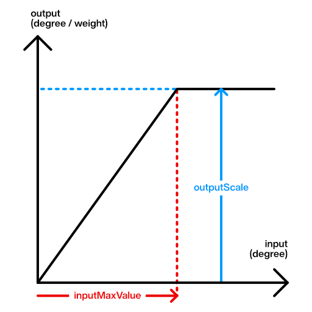

# `VRMC_vrm.lookAt`

!!! warning "🤖 AI 자동 번역 문서"

    이 문서는 AI로 자동 번역된 문서입니다. 아직 검수가 완료되지 않았으므로 **오역이나 부정확한 표현이 포함될 수 있습니다**.

    정확한 내용은 [원본 vrm-specification 문서](https://github.com/vrm-c/vrm-specification)와 비교하여 확인해 주세요.

본 문서에서는 `VRMC_vrm` 확장 중 `lookAt` 필드에 대한 사양을 설명합니다.

## 개요

LookAt은 VRM 모델에 대해 시선 애니메이션을 수행하기 위한 컴포넌트입니다.

초기 자세의 `Head` 본을 오프셋하여 얻은 `LookAt 공간`에서 시선을 정의합니다.
시선 값은 `LookAt 공간`에서의 상하좌우 Degree 값입니다.
본 문서에서는 오른손 좌표계의 Euler 각에 준하는 양의 회전 방향을 갖는 Yaw와 Pitch로 설명합니다.

> Euler 각에 대해서는 플랫폼별로 오른손/왼손, Y-UP/Z-UP 등을 고려하여 일관성 있는 구현을 하십시오.

한 쌍의 yaw, pitch에 의해 두 눈이 같은 방향을 보는 것을 가정하고 있습니다.
이로 인해 사시 등 두 눈이 다른 방향을 향하는 표현은 할 수 없습니다.

## 상세

```json
extensions.VRMC_vrm.lookAt = {
  "offsetFromHeadBone": [
    0,
    0.06,
    0
  ],
  "rangeMapHorizontalInner": {
    "inputMaxValue": 90,
    "outputScale": 10
  },
  "rangeMapHorizontalOuter": {
    "inputMaxValue": 90,
    "outputScale": 10
  },
  "rangeMapVerticalDown": {
    "inputMaxValue": 90,
    "outputScale": 10
  },
  "rangeMapVerticalUp": {
    "inputMaxValue": 90,
    "outputScale": 10
  },
  "type": "bone"
}
```

| 이름                    | 비고                                                                          |
| :---------------------- | :---------------------------------------------------------------------------- |
| type                    | bone 또는 expression                                                          |
| offsetFromHeadBone      | lookAt의 기준 위치(두 눈 사이가 기준)로의 헤드 본으로부터의 위치 offset입니다 |
| rangeMapHorizontalInner | 수평 안쪽의 눈 가동 범위                                                      |
| rangeMapHorizontalOuter | 수평 바깥쪽의 눈 가동 범위(Expression의 LookLeft, LookRight는 이것을 사용)    |
| rangeMapVerticalDown    | 아래 방향의 눈 가동 범위                                                      |
| rangeMapVerticalUp      | 위 방향의 눈 가동 범위                                                        |

### LookAtType

아래의 2종류를 정의하고 있습니다.

| 이름       | 대상                                               | 값               |
| :--------- | :------------------------------------------------- | ---------------- |
| bone       | Humanoid leftEye 본과 rightEye 본의 LocalRotation  | EulerAngles      |
| expression | Expression의 LookAt, LookDown, LookLeft, LookRight | ExpressionWeight |

> expression은 MorphTarget, MaterialColor, TextureTransform이 가능합니다.
> LookAt에서는 주로 MorphTarget에 의한 정점 이동과 TextureTransform에 의한 눈 텍스처의 offset 이동에 의해 시선이 표현되는 것으로 상정하고 있습니다.

### LookAt 공간 (offsetFromHeadBone)

모델이 어떤 대상 물체를 볼 때 시선 방향을 결정하는 데 사용하는 "LookAt 공간"을 정의합니다.

LookAt 공간은 월드 상의 특정 트랜스폼으로부터의 상대적인 공간으로 정의되며, 이 트랜스폼을 다음과 같이 정의합니다.

- 트랜스폼의 부모는 head이며, head의 움직임에 따라 움직입니다.
- 트랜스폼의 head로부터의 로컬 위치는 프로퍼티 `offsetFromHeadBone`에 의해 결정됩니다.
- 트랜스폼의 head로부터의 로컬 회전은 head의 모델 공간에서의 레스트(rest) 회전의 역입니다.

> head가 모델 공간에서의 레스트 회전을 가짐으로써, `offsetFromHeadBone`에 의한 시점 위치의 이동 방향이 모델 공간의 축과 일치하지 않을 수 있습니다.
> 또한, head가 모델 공간에서 레스트 회전을 가지고 있는 경우에도 시선의 앞 방향은 모델 좌표계에서의 +Z 축과 일치합니다.

본 문서에서는 glTF의 오른손 좌표계, Y-Up, Z-Forward 좌표계를 사용하여 설명합니다.
Yaw, Pitch의 양의 방향은 다음과 같습니다.

- Yaw: Z->X 방향 => 왼쪽
- Pitch: Y->Z 방향 => 아래

```
      Y  Forward
      ^  Z
      | /
      |/
X<----+
Left      Right
```

`offsetFromHeadBone`은 VR용 HMD의 위치를 상정하고 있습니다.
모델의 1인칭 시점 위치를 얻고 반영하는 데 사용할 수 있습니다.

> Implementation note: 모델에 `offsetFromHeadBone`이 존재하지 않는 경우, 구현마다 적절한 값으로 폴백(fallback)을 수행하는 것을 권장합니다.

### 범위 맵

`LookAt 공간`에서 평가된 시선 값 `Yaw`와 `Pitch`를 `bone` 또는 `expression`에 적용하기 전에 값을 가공할 수 있습니다.



| name          | 기능                                                                                  |
| ------------- | ------------------------------------------------------------------------------------- |
| inputMaxValue | Yaw 또는 Pitch의 상한값. 이 값이 작을수록 같은 시선 값에 대해 시선이 크게 움직입니다. |
| outputScale   | `bone의 회전` 또는 `Expression의 Weight`의 최댓값.                                    |

#### inputMaxValue가 0일 때의 동작

inputMaxValue가 0으로 설정된 경우, 시선 값이 0일 때는 0을, 그 이외의 경우에는 `outputScale`을 적용하는 것을 권장합니다 (SHOULD).

> Implementation note: 이는 `inputMaxValue`가 0일 때 0으로 나누는 것을 피하기 위한 사양입니다.
> 위의 권장 사항에 충분히 가까운 동작을 구현하기 위해 `inputMaxValue`에 대해 `max(0.001, inputMaxValue)`와 같은 처리를 수행할 것으로 예상됩니다.

#### type이 bone일 때의 해석

`yaw`, `pitch`의 시선 값으로부터 `leftEye` 본과 `rightEye` 본에 대한 `local rotation`을 생성합니다.
`수평 안쪽`, `수평 바깥쪽`, `수직 위쪽`, `수직 아래쪽`의 4가지 구분이 있습니다.

상하좌우의 rangeMap 사용 구분은 다음과 같습니다.

```
  + yaw -     + yaw -
     ^           ^
     |           |
outer|inner inner|outer
  left eye    right eye
```

|             | leftEye rangeMap        | rightEye rangeMap       |
| ----------- | ----------------------- | ----------------------- |
| Yaw>0(좌)   | rangeMapHorizontalOuter | rangeMapHorizontalInner |
| Yaw<0(우)   | rangeMapHorizontalInner | rangeMapHorizontalOuter |
| Pitch>0(하) | rangeMapVerticalDown    | rangeMapVerticalDown    |
| Pitch<0(상) | rangeMapVerticalUp      | rangeMapVerticalUp      |

범위 맵은 시선 값에 의해 얻어진 Euler 각 (degree)의 절대값에 대해 수행합니다.
출력 단위는 눈 본의 Euler 각 (degree)이 됩니다.

```
const boneLocalEulerAngle = min(fabs(value), inputMaxValue)/inputMaxValue * outputScale;
```

#### type이 expression일 때의 해석

`lookUp` Expression, `lookDown` Expression, `lookLeft` Expression, `lookRight` Expression에 대한 `weight`를 생성합니다.
`수평`, `수직 위쪽`, `수직 아래쪽`의 3가지 구분이 있습니다.
하나의 Expression으로 두 눈이 함께 변화하므로, `수평 안쪽`, `수평 바깥쪽`의 구분이 없음에 주의하십시오.
`rangeMapHorizontalOuter`를 사용합니다.

|             | expression | rangeMap                |
| ----------- | ---------- | ----------------------- |
| Yaw>0(좌)   | lookLeft   | rangeMapHorizontalOuter |
| Yaw<0(우)   | lookRight  | rangeMapHorizontalOuter |
| Pitch>0(하) | lookDown   | rangeMapVerticalDown    |
| Pitch<0(상) | lookUp     | rangeMapVerticalUp      |

범위 맵은 시선 값에 의해 얻어진 Euler 각 (degree)의 절대값에 대해 수행합니다.
출력 단위는 눈의 expression의 weight 값이 됩니다.

```
const expressionWeight = min(fabs(value), inputMaxValue)/inputMaxValue * outputScale;
```

## LookAt의 알고리즘

### Yaw and Pitch in lookAt space

```cs
public static (float Yaw, float Pitch) CalcYawPitch(this Matrix4x4 lookAtSpace, Vector3 target)
{
    var localTarget = lookAtSpace.inverse.MultiplyPoint(target);

    var z = Vector3.Dot(localPosition, Vector3.forward);
    var x = Vector3.Dot(localPosition, Vector3.right);
    var yaw = (float)Math.Atan2(x, z) * Mathf.Rad2Deg;

    // x+y z plane
    var xz = Mathf.sqrt(x * x + z * z);
    var y = Vector3.Dot(localPosition, Vector3.up);
    var pitch = (float)Math.Atan2(-y, xz) * Mathf.Rad2Deg;

    return (yaw, pitch);
}
```

### Apply Yaw and Pitch to bone

```
function applyLeftEyeBone(vrm, yawDegrees, pitchDegrees)
{
  var yaw = 0;
  if(yawDegrees>0)
  {
    // left => outer
    yaw = min(fabs(yawDegrees), rangeMapHorizontalOuter.inputMaxValue) / rangeMapHorizontalOuter.inputMaxValue * rangeMapHorizontalOuter.outputScale;
  }
  else{
    // right => inner
    yaw = -min(fabs(yawDegrees), rangeMapHorizontalInner.inputMaxValue) / rangeMapHorizontalInner.inputMaxValue * rangeMapHorizontalInner.outputScale;
  }

  var pitch = 0;
  if(pitchDegrees>0)
  {
    // down
    pitch = min(fabs(pitchDegrees), rangeMapVerticalDown.inputMaxValue) / rangeMapVerticalDown.inputMaxValue * rangeMapVerticalDown.outScale;
  }
  else{
    // up
    pitch = -min(fabs(pitchDegrees), rangeMapVerticalUp.inputMaxValue) / rangeMapVerticalUp.inputmaxValue * rangeMapVerticalUp.outScale;
  }

  vrm.humanoid.leftEye.localRotation = Quaternion.from_YXZEuler(yaw, pitch, 0);
}

function applyRightEyeBone(vrm, yawDegrees, pitchDegrees)
{
  var yaw = 0;
  if(yawDegrees>0)
  {
    // left => inner
    yaw = min(fabs(yawDegrees), rangeMapHorizontalInner.inputMaxValue) / rangeMapHorizontalInner.inputMaxValue * rangeMapHorizontalInner.outputScale;
  }
  else{
    // right => outer
    yaw = -min(fabs(yawDegrees), rangeMapHorizontalOuter.inputMaxValue) / rangeMapHorizontalOuter.inputMaxValue * rangeMapHorizontalOuter.outputScale;
  }

  var pitch = 0;
  if(pitchDegrees>0)
  {
    // down
    pitch = min(fabs(pitchDegrees), rangeMapVerticalDown.inputMaxValue) / rangeMapVerticalDown.inputMaxValue * rangeMapVerticalDown.outScale;
  }
  else{
    // up
    pitch = -min(fabs(pitchDegrees), rangeMapVerticalUp.inputMaxValue) / rangeMapVerticalUp.inputmaxValue * rangeMapVerticalUp.outScale;
  }

  vrm.humanoid.rightEye.localRotation = Quaternion.from_YXZEuler(yaw, pitch, 0);
}
```

### Apply Yaw and Pitch to expression

```
function applyExpression(vrm, yawDegrees, pitchDegrees)
{
  // horizontal
  if(yawDegrees>0)
  {
    // left
    const yawWeight = min(fabs(yawDegrees), rangeMapHorizontalOuter.inputMaxValue)/rangeMapHorizontalOuter.inputMaxValue * rangeMapHorizontalOuter.outputScale;
    vrm.expression.setWeight(LOOK_LEFT, yawWeight);
    vrm.expression.setWeight(LOOK_RIGHT, 0);
  }
  else{
    // right
    const yawWeight = min(fabs(yawDegrees), rangeMapHorizontalOuter.inputMaxValue)/rangeMapHorizontalOuter.inputMaxValue * rangeMapHorizontalOuter.outputScale;
    vrm.expression.setWeight(LOOK_LEFT, 0);
    vrm.expression.setWeight(LOOK_RIGHT, yawWeight);
  }

  // vertical
  if(pitchDegrees>0)
  {
    // down
    const pitchWeight = min(fabs(pitchDegrees), rangeMapVerticalDown.inputMaxValue)/rangeMapVerticalDown.inputMaxValue * rangeMapVerticalDown.outputScale;
    vrm.expression.setWeight(LOOK_DOWN, pitchWeight);
    vrm.expression.setWeight(LOOK_UP, 0);
  }
  else{
    // up
    const pitchWeight = min(fabs(pitchDegrees), rangeMapVerticalUp.inputMaxValue)/rangeMapVerticalUp.inputMaxValue * rangeMapVerticalUp.outputScale;
    vrm.expression.setWeight(LOOK_DOWN, 0);
    vrm.expression.setWeight(LOOK_UP, pitchWeight);
  }
}
```
